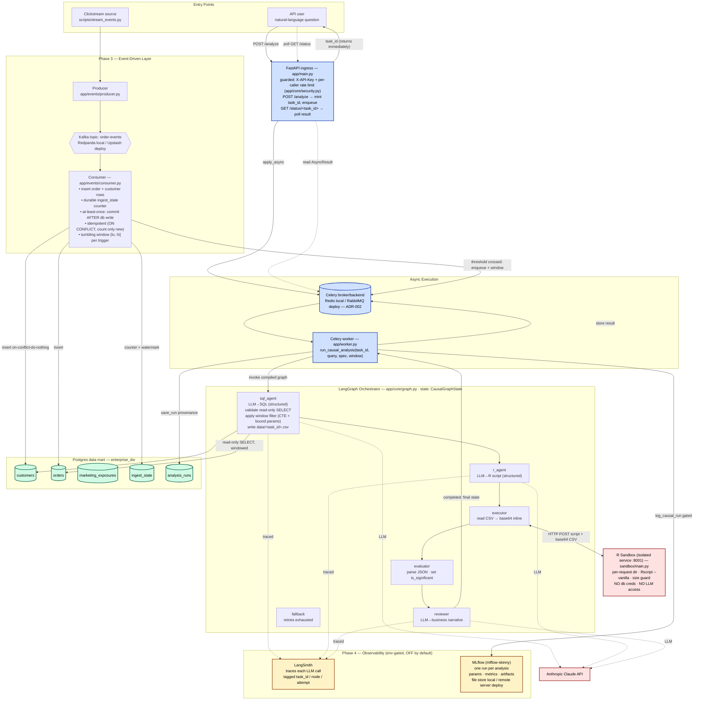
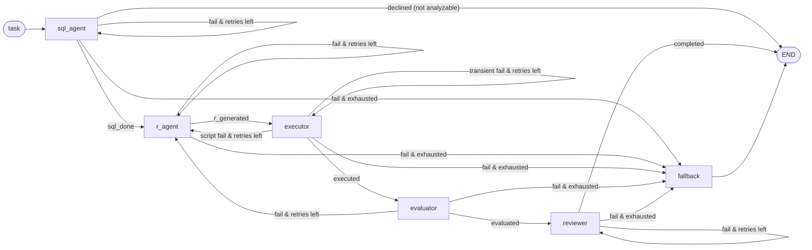

# CausalAgent — Architecture

A distributed, polyglot multi-agent platform that turns a natural-language
question into a rigorous causal-inference model (R) executed against an
enterprise data mart. Two entry paths — a synchronous API and an event-driven
clickstream layer — feed the same asynchronous analysis pipeline.

## Full system architecture

## Orchestrator retry / fallback state machine

## Design invariants

- **Two entry paths, one engine.** The synchronous API and the event-driven
  consumer both enqueue the *same* `run_causal_analysis` Celery task; the event
  layer reuses the analysis pipeline rather than forking it.
- **Context protection (no raw rows to the LLM).** Rows flow
  producer→Kafka→consumer→Postgres and DB→CSV→sandbox. The LLM (dotted edges)
  touches only `sql_agent`, `r_agent`, and `reviewer` — never raw data. The
  extracted CSV is purged after every run (`cleanup.purge_extracted_data`), and
  error text is redacted **at capture** so the `/status` API and the audit DB
  never receive raw values. `/status` returns a curated result, not internal
  state. See `SECURITY.md` and ADR-005.
- **Least-privilege data access.** The untrusted extraction query runs through a
  dedicated read-only engine connecting as `causal_ro` (SELECT on the three
  analytics tables only — no writes, no other tables, no superuser functions);
  the trusted write paths (audit, ingest) keep the owner role. A
  `statement_timeout` bounds a runaway query. So a prompt-injected SELECT is
  contained even if it slips past validation.
- **Isolated polyglot execution.** The executor reaches the R sandbox only over
  HTTP with an inline base64 CSV; the sandbox holds no DB credentials and no LLM
  access, and runs each request in its own throwaway directory. Hardened:
  `cap_drop ALL` (+`NET_ADMIN` only), an `iptables`+`ip6tables` egress lockdown
  (a script cannot exfiltrate the rows it holds), read-only rootfs (tmpfs-only
  writable paths), a non-root uid, an env allowlist, and a loopback-only port.
- **Bounded, per-node retries.** Each node has its own `MAX_RETRIES` budget
  (tracked in `retries`, keyed by node name) and appends the error on failure,
  so a single hiccup at each of several stages no longer trips one shared
  counter. Recovery depends on the failure, not just the stage: SQL failures
  retry `sql_agent`; a bad R script (generation, a non-zero `Rscript` exit, or
  unparseable output) retries `r_agent`; a *transient* executor failure (sandbox
  unreachable, timeout, 5xx) retries the executor itself, since regenerating a
  probably-fine script cannot fix unreachable infrastructure. Once the failing
  node exhausts its budget the graph routes to a terminal `fallback` node so a
  task always ends cleanly. A **permanent** LLM error (auth/bad-request/policy,
  classified by HTTP status in `feedback.py`) exhausts the node immediately and
  fails fast to a distinct `fatal_llm_error` fallback — no point regenerating a
  call that will fail identically; transient errors (429/5xx) stay retryable.
- **Trust surfaced, not buried.** The result carries a deterministic
  `interpretation` line (verify the question was read correctly), `/status`
  reports live `current_status` progress, and failures give per-stage actionable
  guidance — the pipeline exposes what it already computes at the three
  trust-critical moments. See ADR-005.
- **Sensitivity is reported, not assumed away.** An observational estimate only
  identifies a causal effect under *no unobserved confounding* — untestable. Every
  estimate therefore carries an **E-value** (`sensitivity.py`, computed in Python,
  not the LLM R) quantifying how strong an unmeasured confounder would have to be
  to overturn it, plus a propensity **overlap** (positivity) fraction on the
  matched path. The narrative states both in plain language.
- **Abstain over fabricate (honesty guard).** On the free-text path, a question
  that isn't a well-posed causal question over the schema is **declined cleanly**
  (`sql_agent` sets `answerable=false`; the graph routes `declined → END`) rather
  than forced into a meaningless analysis. A pinned spec (Discord treatment choice
  or the event-trigger) skips the guard — the caller already declared the question.
- **Tested and gated.** Security-critical logic (SQL validation, redaction,
  cleanup, error classification, interpretation, fallback, progress) has
  regression tests, run on every push/PR by `.github/workflows/ci.yml`.
- **Event-layer correctness.** At-least-once delivery (offset committed only
  after the DB write), idempotent inserts, a durable restart-safe counter, and
  at-most-once triggering per threshold bucket. Tumbling windows analyse one
  fresh batch of orders `(lo, hi]` per trigger, keyed on the stream's
  monotonically increasing `order_id`.
- **Observability is opt-in, never default (Phase 4).** Both LangSmith tracing
  and MLflow run-tracking are governed by single env gates (`tracing_enabled()`,
  `mlflow_enabled()`) that default OFF; tracing's off-path *forces*
  `LANGCHAIN_TRACING_V2=false` so an ambient env var can't leak prompts. MLflow
  logging is best-effort in the worker (a tracking failure never loses the
  result, like the `analysis_runs` write). Raw rows are never traced — Rule 2
  already keeps them out of every LLM call. See ADR-003 and ADR-004.

## Front door & demo layer

The engine has one analysis pipeline behind several surfaces:

- **Discord adapter** (`app/bots/`) — a `/causal-agent` slash command is the human
  front door. It is a *thin client over the HTTP ingress* (defer → `POST /analyze`
  → poll `/status` → post the narrative); it never imports the worker, so the bot
  and the API stay decoupled. An optional treatment choice pins the spec for a
  deterministic run; free text lets the SQL agent self-identify.
- **Simulation** (`app/sim/`) — a single confounded multi-treatment generator
  (`effects.py`, the source of truth for both the bulk seed and the live stream)
  plants known effects, including a true-null **placebo**, so the agent's output is
  *checkable* against ground truth. The env-gated `/sim` routes (`routes.py`) drive
  a fake storefront: `POST /sim/emit` publishes synthetic orders onto the same
  Kafka topic the consumer ingests, and `GET /sim/truth` renders planted-vs-naïve
  estimates. Off unless `ENABLE_SIM_ROUTES` is set (see `SECURITY.md`).

## Component map

| Layer | Path | Responsibility |
|---|---|---|
| Ingress | `app/main.py` | Accept query, mint `task_id`, enqueue task; guarded by API-key auth + rate limit |
| Ingress security | `app/core/security.py` | `X-API-Key` auth (`INGRESS_API_KEYS`, open-by-default) + per-caller fixed-window rate limit on `/analyze` + `/status` |
| Discord adapter | `app/bots/` | Slash-command front door; thin client over the HTTP ingress (no worker import) |
| Demo simulation | `app/sim/` | Confounded multi-treatment generator + env-gated `/sim` emit/truth/storefront routes |
| Sensitivity | `app/core/sensitivity.py` | E-value (unobserved-confounding sensitivity), computed deterministically |
| Event producer | `app/events/producer.py`, `scripts/stream_events.py` | Emit synthetic order events to Kafka |
| Event consumer | `app/events/consumer.py` | Ingest events, count durably, trigger windowed analysis |
| Worker | `app/worker.py` | Drive the graph (streamed for progress), purge CSV, curate result |
| Orchestrator | `app/core/graph.py`, `app/core/state.py` | Wire agents + conditional retry edges + actionable fallback |
| Agents | `app/agents/*.py` | sql_agent, r_agent, executor, evaluator, reviewer |
| Failure handling | `app/agents/feedback.py` | Redact-at-capture, classify permanent vs transient, self-correct |
| PII cleanup | `app/core/cleanup.py` | Purge the extracted CSV after each run |
| Sandbox | `sandbox/main.py`, `sandbox/entrypoint.sh` | Isolated `Rscript` over HTTP; egress lockdown + privilege drop at startup |
| Persistence | `app/core/persistence.py` | Write run provenance to `analysis_runs` |
| Database engines | `app/core/db.py` | `get_engine` (trusted writes) + `get_readonly_engine` (untrusted extraction) |
| Observability | `app/core/observability.py` | Gated LangSmith tracing + MLflow run logging (Phase 4) |
| Config | `app/core/config.py` | All hosts/ports/keys/roles from environment |
| Agent evals | `scripts/eval_agent.py`, `scripts/redteam_agent.py` | Live identification/recovery eval + injection red-team (on-demand) |
| CI | `.github/workflows/ci.yml` | Run the suite (with Postgres) on push + PR |

See `SECURITY.md` for the responsible-AI posture and `decisions/ADR-005-responsible-ai-hardening.md`
for the hardening rationale.
